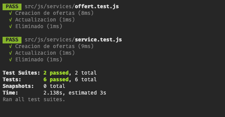

# Inworkers 🛠

Esta plataforma te permitirá contratar albañiles, plomeros y cualquier otro tipo de trabajo temporal que necesites.

## Enlace a firebase

[https://inworkerss.firebaseapp.com/](https://inworkerss.firebaseapp.com/)

## Entidades
 * Usuario
 * Oferta
 * Comentario
 * Servicio

## Pruebas unitarias de las entidades `Jest`

`create-react-app` ya viene con un configuración lista para realizar pruebas con `Jest`.

 1. Cada archivo `.test.js` esta dentro de la carpeta de servicios
 2. Para ejecutar todas las pruebas unitarios ejecutar  del terminal `npm test`.

## Variables de entorno
Dentro del proyecto se encuentra un archivo `.env` que contiene todas las variables de configuración, incluyendo las de **firebase**. Estas deben seguir la forma `REACT_APP_<Nombre>` para que pueda funcionar.

Luego para acceder a ellas se debe hacer por medio de `process.env`
>  Más info [https://create-react-app.dev/docs/adding-custom-environment-variables/](https://create-react-app.dev/docs/adding-custom-environment-variables/)

## ¿Como se despliega?
1. Instalar firebase globalmente
### `npm install firebase-tools --global`
Install Firebase CLI [https://firebase.google.com/docs/cli/?hl=es-419](https://firebase.google.com/docs/cli/?hl=es-419)

2. Compilar el código  de react a `html css js`
### `npm run build`

3. Subir la carpeta `/build` a firebase hosting
### `firebase deploy --only hosting`
See guide on [https://firebase.google.com/docs/hosting/quickstart?hl=es-419](https://firebase.google.com/docs/hosting/quickstart?hl=es-419)

## Script para probar de manera local

### `npm start `

Correr la app en modo desarrollo. 
abrir [http://localhost:3000](http://localhost:3000) 

